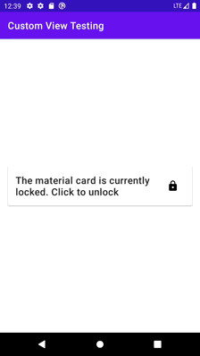

# Testing Custom Android Views 

This is a sample app that tests a custom Android view component with [Robolectric](http://robolectric.org). 

## Resources 

* [Create custom Android view](https://developer.android.com/training/custom-views/create-view) - official Android documentation for creating a custom view
* [Robolectric documentation](http://robolectric.org) - a framework that brings fast and reliable unit tests to Android. Tests run inside the JVM on your workstation in seconds
* [Mockk](https://mockk.io) - Kotlin mocking library